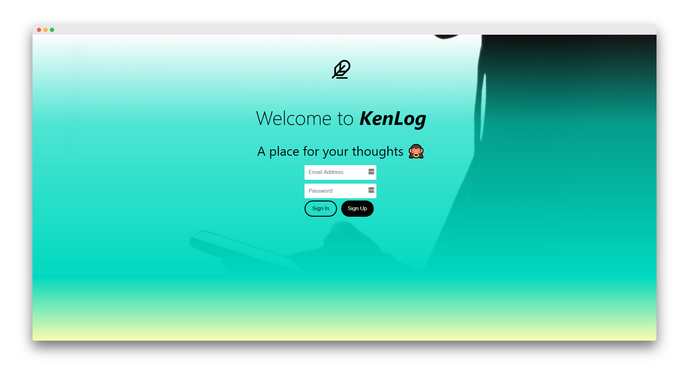

# My Portfolio

## Adding Projects

Copy and paste project dive

    

        
        <h2>KenLog</h2>
        
A place for your thoughts. A journaling app.

    

into 'portfolio' div

Then set `.portfolio-height(num)` in index.less with `num` is the number of projects. It should be in the portfolio block inside `index.less`.

Depending on the content of inside your project dive, you might need to edit `@project-height` variables at the top of index.less file.

### Notes
- You need to install [less-watch-compiler](https://www.npmjs.com/package/less-watch-compiler)
- Run `less-watch-compiler less css index.less` to apply changes made in index.less
- FeatherIcons are used. [Learn More](https://github.com/feathericons/feather#feather)
